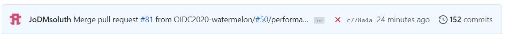
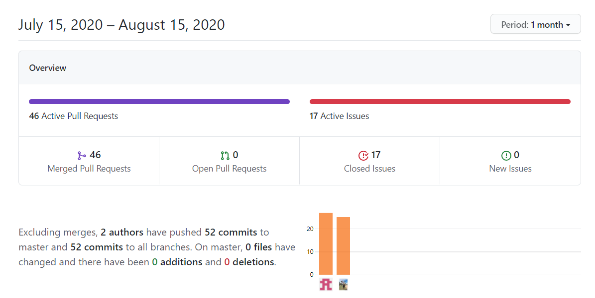

[](https://github.com/dwyl/esta/issues)
[](https://github.com/microsoft/TypeScript) 

# 👨‍👧‍👧 OIDC 공모전 (WaterMelone팀)

<div align="center"> 
이벤트 티켓 예매 서비스를 위한 웹 어플리케이션
</div>

---

\
\
[]()

## 🔖우리 조는 한 달 동안...

#### 150여개의 **commit** 40여개의 **pr**이 있었어요!

<div align="center" style="display:flex;">
	
</div>

<div align="center" style="display:flex;">
	
</div>

\
[]()

## 📋 서비스 플로우

1. 고객은 소셜계정으로 회원가입 및 로그인
2. 원하는 상품을 클릭한 후 공연에 대한 상세한 정보확인
3. 공연을 예매한 후 자신의 예매를 관리
4. 서버는 고객의 서비스 이용 로그를 분석
5. 추후 같은 공연을 발주시 얼마만큼의 예매서버 리소스를 열어야 할지 추측

\
[]()

## 🛠 기술스택

- Common: [Typescript](https://www.typescriptlang.org/)

- Front-End: [React.js](https://ko.reactjs.org/), [Redux](https://redux.js.org/), [Styled-components](https://styled-components.com/)

- Infra: [Docker](https://www.docker.com/), [NCloud](https://www.ncloud.com/)

---

\
\
[]()

## 💻 팀원

| **Front**                                  | **Back**                                   |
| ------------------------------------------ | ------------------------------------------ |
| 👨‍💻[조혜형](https://github.com/JoDMsoluth)  | 👩‍💻[김화목](https://github.com/hwamoc)      |
| 👩‍💻[정진리](https://github.com/JinleeJeong) | 👩‍💻[이창권](https://github.com/changgunyee) |
|                                            | 👨‍💻[김용민](https://github.com/ymink716)    |

\
\
[]()

# 파일 구조

### 기본적인 폴더 구조 및 설명

<br>

#### Src 폴더 구조

    .
    src                   		 # Source files
    ├── components                    # 리액트에서 사용하는 컴포넌트들 모임
    ├── assets                        # 각종 static 파일들
    ├── lib                           # 각종 유틸 파일들
    ├── pages                         # react-router-dom 따라 보여주는 페이지 컴포넌트들
    ├── types                         # 각종 타입과 인터페이스
    └── models                        # redux saga 혹은 useReducer + useContext에 대한 파일들

#### 파일 계층

> 최상위 -> 최하위
> index -> App -> src/pages -> src/containers -> src/components

---

\
\
[]()

# branch

```
	feature/main : push 했을 때 ci/cd가 되는 release 브랜치
	submit : git clone해서 로컬에서 평가하기 위한 브랜치
```

---

\
\
[]()

# Get Started
```javavscript
 // npm i : dependancies 설치
 npm i 
 // npm start : 어플리케이션 실행
 npm start
 
 // 네이버 로그인
 id : isingbeauty
 password : oidc2020!
 
 // 관리자 로그인
 id(1) : watermelon@wm.com
 id(2) : watermelon1@wm.com
 id(3) : watermelon2@wm.com
 id(4) : watermelon3@wm.com
 id(5) : watermelon4@wm.com
 password : oidc2020
```

---

\
\
[]()

# CICD

- 😎 git push -> jenkins_server ( CI ) -> slack notification -> front_server ( CD ) :fire::fire::fire:

- [배포 Link](http://101.101.218.225/)

---
